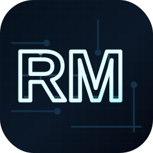
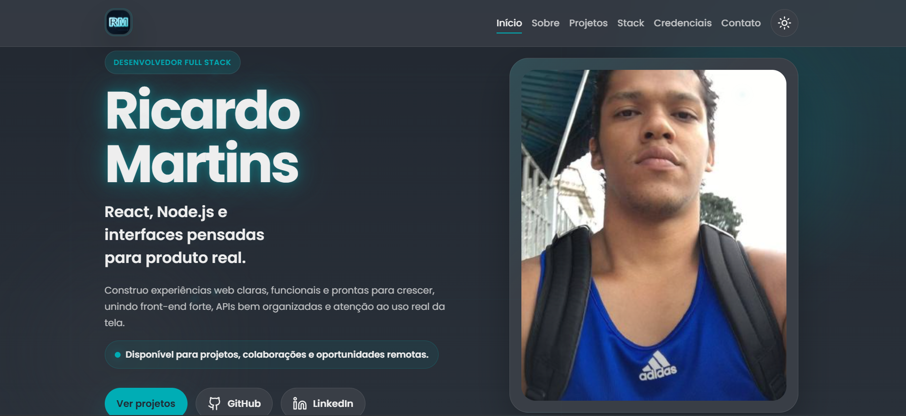

<p align="center">
  
</p>

<h1 align="center">Portfolio - Ricardo Martins</h1>

<p align="center">
  Portfolio pessoal com foco em projetos reais, stack, formacao, certificados e contato.
</p>

<p align="center">
  
  
  
  
  
</p>

## Sobre

Este projeto foi construido para apresentar meu trabalho de forma clara, profissional e visualmente marcante, sem perder legibilidade.

O portfolio destaca:

- projetos com foco em entrega real
- stack principal de trabalho
- formacao academica
- certificados e badges
- formas de contato

## Preview

<p align="center">
  
</p>

O site foi pensado para mostrar:

- hero com apresentacao objetiva e CTA direto
- secao de projetos com imagem, stack e contexto
- secao de stack com foco no papel de cada tecnologia
- secao de formacao e certificados
- tema claro e escuro
- responsividade para desktop, tablet e mobile

## Stack

- HTML5
- CSS3
- JavaScript
- Lucide Icons
- Google Fonts

## Arquivos principais

```text
.
|-- preview.png
|-- index.html
|-- styles.css
|-- script.js
`-- brand-rm.svg
```

- `index.html`: estrutura principal do portfolio
- `preview.png`: captura do site usada no README
- `styles.css`: estilos, responsividade, temas e animacoes
- `script.js`: interacoes, efeitos, tema e comportamento da pagina
- `brand-rm.svg`: logo RM usado na navegacao

## Como rodar localmente

Voce pode abrir o `index.html` direto no navegador.

Se preferir rodar com servidor local:

```bash
python -m http.server 8000
```

Depois abra:

```text
http://localhost:8000
```

## Personalizacao

Os dados principais ficam em:

- `index.html`
- `script.js`

No `script.js`, o objeto `defaultConfig` concentra:

- nome
- titulo profissional
- bio
- e-mail
- titulos e descricoes dos projetos
- skills

## Deploy

Este projeto pode ser publicado facilmente em:

- GitHub Pages
- Netlify
- Vercel

Para GitHub Pages:

1. envie os arquivos para um repositorio
2. mantenha `index.html` na raiz
3. ative o GitHub Pages nas configuracoes do repositorio

## Licenca

Este projeto e proprietario.

- Copyright (c) 2026 Ricardo Martins
- All rights reserved
- Nao e permitida copia, modificacao, redistribuicao ou uso derivado sem autorizacao previa por escrito

## Proximos passos

- adicionar demos online nos projetos
- usar uma imagem propria para `og:image`
- incluir previews reais de todos os projetos
- adicionar curriculo em PDF

## Contato

- GitHub: [github.com/tuiusx](https://github.com/tuiusx)
- LinkedIn: [linkedin.com/in/tuius-martins](https://www.linkedin.com/in/tuius-martins/)
- E-mail: `ricardo.martins@aluno.impacta.edu.br`
